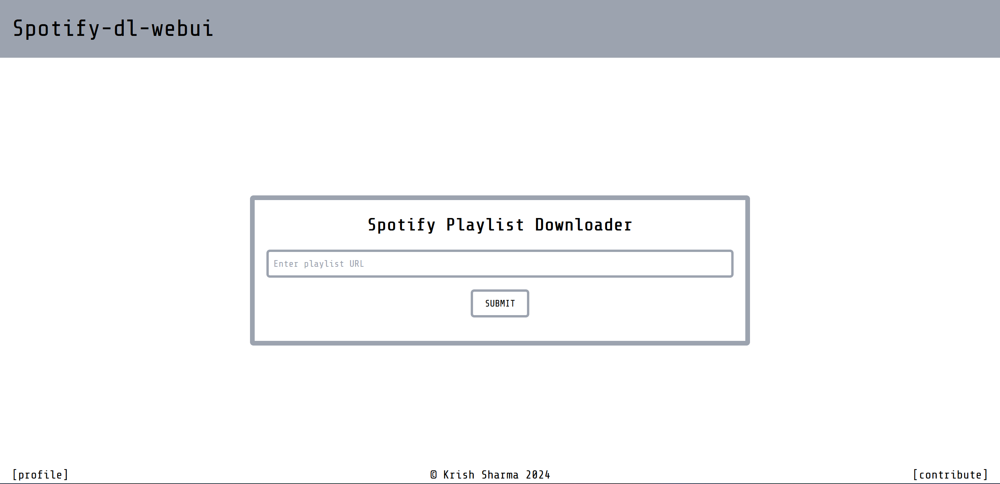
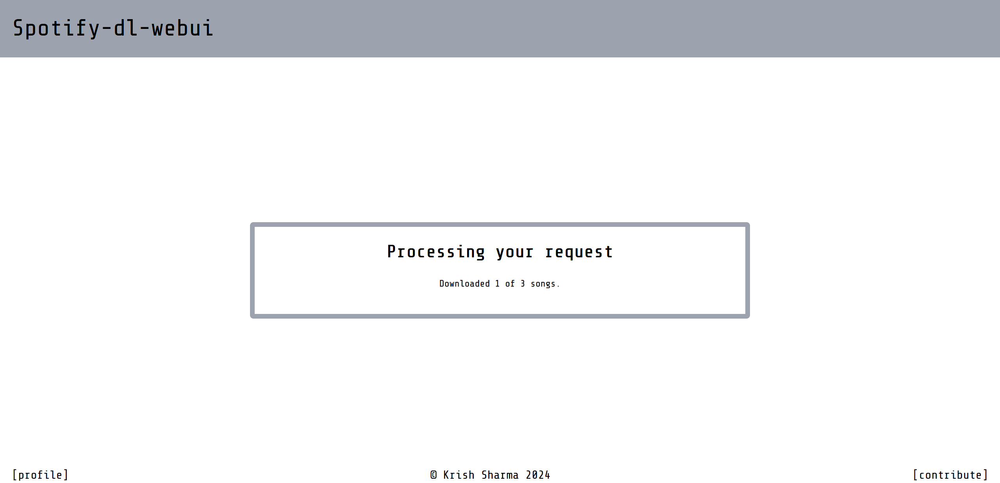
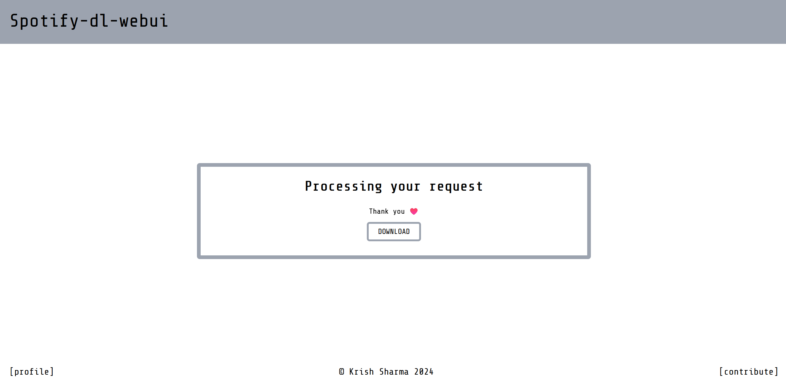

# spotify-dl-webui 🎵

A simple web interface for [spotify-dl](https://github.com/SathyaBhat/spotify-dl/) that uses FastAPI.

## Installation ⚙️

1. Clone the [repository](https://github.com/krishsharma0413/spotify-dl-webui)
2. Install the requirements
3. Run the server

```bash
git clone https://github.com/krishsharma0413/spotify-dl-webui.git
cd spotify-dl-webui
pip install -r requirements.txt
py main.py
```

## Features 🎉
- ✅ Download songs from Spotify Playlist.
- ✅ Asyncronous download.
- ✅ Progress of download using websockets.
- ✅ Not just personal use, but can be deployed on a server for public use.


## Screenshots 📸

The route `/` will take you to the home page where you can paste the Spotify URL and click on the `SUBMIT` button to download the song.

The place where the magic happens 🪄


The progress of the download can be seen using websockets. 🫶🏻


The download is complete. 🎉



## License 📜
This project is licensed under the MIT License - see the [LICENSE](LICENSE) file for details.

## Contributing 🤝
Contributions are always welcome! Feel free to open any issues before a pull requests.
You can also contribute by reporting issues or suggesting new features! 🚀